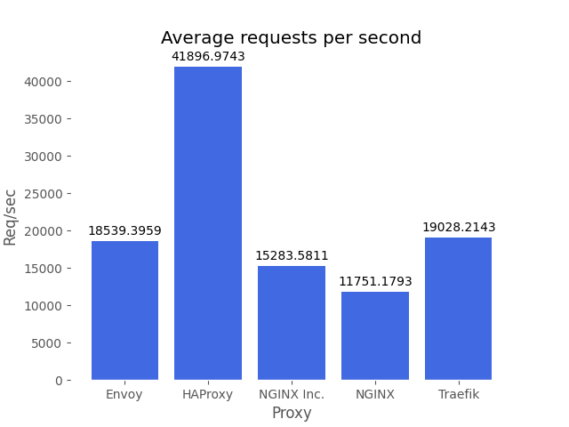
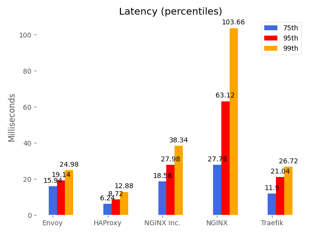
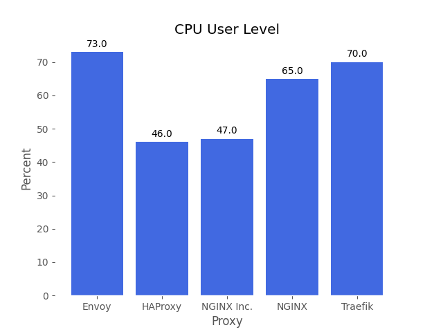
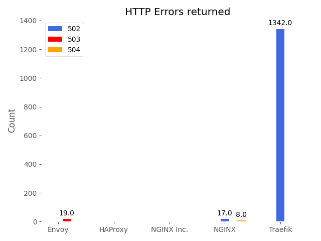

# Kubernetes Ingress Controller Benchmark

In this guide we are going to benchmark 5 popular Ingress Controllers in Kubernetes with their default out-of-box configurations.
Traffic is sent from "http load generators" deployed in the same cluster.
Deploying http load generators in Kubernetes is useful as we want to take advantage of Kubernete's orchestration capabilities to easily deploy and scale injectors.

**Note: While the load generators and Ingress Controllers are going to be on the same Kubernetes cluster they will be provisioned on completely different nodes. We will reserve one of the nodes exclusively for running the ingress controllers.**


- [Prequisites](#prequisites)
- [Quickstart](#quickstart)
- [Overview](#overview)
- [Ingress Controllers](#ingress-controllers)
- [Methodology](#methodology)
- [Results](#results)
  - [5 Load Generators (50 concurrent requests each)](#5-load-generators-50-concurrent-requests-each)

## Prequisites
To be able to run this benchmark you will need the following:
- AWS IAM Key
- Terraform 0.12+

## Quickstart
1. Clone repository
```
git clone github
```
2. cd deploy/terraform
3. Generate SSH key
```
ssh-keygen -f k8benchmarks -t rsa
```
4. Run terraform
```
terraform init
terraform apply -auto-approve -var 'aws_access_key=<ACCESS_KEY>' -var 'aws_secret_key=<SECRET_KEY>'
```
5. SSH to the instance provided within the terraform output
6. After waiting for the Kubernetes cluster to fully initialize, execute the benchmarks.
```
# For a single http load generator running 250 concurrent connections
./benchmark.sh single
```
```
# For 5 http load generators running 50 concurrent connections each
./benchmark saturate
```

## Overview
### Kubernetes Cluster
This repository will launch a 6 node Kubernetes cluster using AWS c5.xlarge type instances:
- One worker node will be dedicated to the ingress controllers
- The other 5 worker nodes will be used for running the benchmarks using `hey` as well as the backend "echo" application.

### Ingress Controllers
We will benchmark the following ingress controllers:

- [Contour (Envoy based)](https://github.com/projectcontour/contour)
- [HAProxy Ingress Controller](https://github.com/haproxytech/kubernetes-ingress)
- [NGINX Ingress Controller (Kubernetes community)](https://github.com/kubernetes/ingress-nginx)
- [NGINX Inc. Ingress Controller](https://github.com/nginxinc/kubernetes-ingress)
- [Traefik](https://github.com/containous/traefik)

### Out of the box
These tests focus explicitly on testing each ingress controller with its default out-of-box configuration.
No system or software tunings have been made.

### Application
A simple echo server application has been configured with 5 pods running at start.

### Methodology
- Each test will run for 6 minutes.
- After 30 seconds of running:
    - Pod scale out test:
        - Initiate a pod scale out from 5 to 7
        - Sleep for 30 seconds
        - Initiate pod scale down from 7 to 5
        - Sleep for 30 seconds
        - Repeat 3 times
    - Configuration change test:
        - Wait for pod scale out test to complete
        - Sleep for 30 seconds
        - Add CORS response header
        - Sleep for 30 seconds
        - Remove CORS response header
        - Sleep for 30 seconds
        - Add path rewrite
        - Sleep for 30 seconds
        - Remove path rewrite


## Results
### 5 load generators (50 concurrent requests each)







-------

